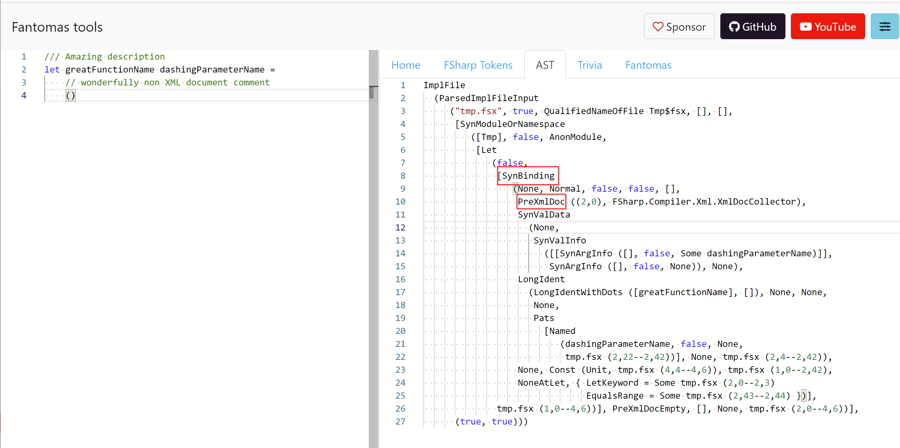

## Intro

Yesterday, pretty much out of nowhere, [FCS 41.0.3](https://www.nuget.org/packages/FSharp.Compiler.Service/41.0.3) was published on NuGet.
I must say, I'm pretty hyped about this release. It contains a few [PRs](https://github.com/dotnet/fsharp/pulls?q=is%3Apr+is%3Aclosed+author%3Anojaf+merged%3A2021-10-30..2022-03-03) that improve the syntax tree and provide more information to work within Fantomas.

It also contains some [XML documentation improvements](https://github.com/dotnet/fsharp/pulls?q=is%3Apr+11973+12484+12783) that Alex of the Rider team has been working on.
You can read the details about this new XML collecting mechanism in this [RFC](https://github.com/fsharp/fslang-design/blob/main/tooling/FST-1035-xml-documentation-collecting-mechanism.md). It is a nice improvement and I've decided to implement an [enhancement in Fantomas](https://github.com/fsprojects/fantomas/issues/1878) due to these changes.

## There actually are comments in the syntax tree

In the past, I had the luxury of [speaking about Fantomas](/public-speaking) at conferences. In a lot of these talks, I explain how Fantomas works and rant a bit [about code comments not being a part of the syntax tree](https://youtu.be/R9Ob5Vp4a9c?t=1580). Now that isn't exactly true. You see, at some very specific locations, triple-slash comments are preserved in the untyped syntax tree as [PreXmlDoc](https://fsharp.github.io/fsharp-compiler-docs/reference/fsharp-compiler-xml-prexmldoc.html).

We used to ignore this information in Fantomas, and capture those comments the same way we capture other types of comments. Which at the time seemed like the right thing to do.
Now that the collection mechanism changed at the compiler side, we can start trusting those comments.

## One less trivia

The more information we have in the untyped syntax tree, the better. So, we decide in [Fantomas 4.7](https://github.com/fsprojects/fantomas/releases/tag/v4.7.0) to not accept triple-slash code comments as trivia comments anymore.
This can lead to some [unexpected situations](https://github.com/fsprojects/fantomas/issues/2126). Triple slash comments are only collected by the F# parser at very specific locations.

One example is [SynBinding](https://fsharp.github.io/fsharp-compiler-docs/reference/fsharp-compiler-syntax-synbinding.html):

In essence, every data type in [SyntaxTree.fsi](https://github.com/dotnet/fsharp/blob/main/src/fsharp/SyntaxTree.fsi), that has a `PreXmlDoc` node can contain a triple-slash comment.

## Awareness

This change in Fantomas 4.7 can be a bit impactful. I admit I got a bit carried away by the unexpected FCS release. I don't regret this change and I believe it will educate end-users that there is a subtle difference between `///` and `//` in FSharp code. But yes, depending on how you were using this, you might need to add a new entry in your [.git-blame-ignore-revs file](https://github.com/fsprojects/fantomas/blob/master/docs/Documentation.md#updating-to-a-new-fantomas-version).

Cheers,

Florian

Photo by <a href="https://unsplash.com/@fahrulazmi?utm_source=unsplash&utm_medium=referral&utm_content=creditCopyText">Fahrul Azmi</a> on <a href="https://unsplash.com/s/photos/three?utm_source=unsplash&utm_medium=referral&utm_content=creditCopyText">Unsplash</a>
  