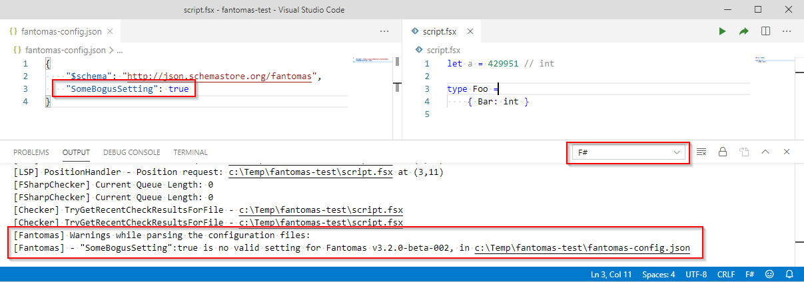

Hi all,

The cat's out of the bag:

<blockquote class="twitter-tweet"><p lang="en" dir="ltr">New version of <a href="https://twitter.com/IonideProject?ref_src=twsrc%5Etfw">@IonideProject</a> is out - it updates Fantomas support to the latest version including support for Fantomas configuration file (<a href="https://t.co/Pw3TqQ4kYe">https://t.co/Pw3TqQ4kYe</a>)<br><br>Props to <a href="https://twitter.com/verdonckflorian?ref_src=twsrc%5Etfw">@verdonckflorian</a> and <a href="https://twitter.com/ChetHusk?ref_src=twsrc%5Etfw">@ChetHusk</a> for working on this. <a href="https://twitter.com/hashtag/fsharp?src=hash&amp;ref_src=twsrc%5Etfw">#fsharp</a> <a href="https://twitter.com/hashtag/toolingAdventures?src=hash&amp;ref_src=twsrc%5Etfw">#toolingAdventures</a></p>&mdash; Krzysztof Cieślak (@k_cieslak) <a href="https://twitter.com/k_cieslak/status/1215239179472375808?ref_src=twsrc%5Etfw">January 9, 2020</a></blockquote> <script async src="https://platform.twitter.com/widgets.js" charset="utf-8"></script>

Fantomas now has support for configuration files.
This means you can override the default settings using a JSON file.
Check out [the documentation](https://github.com/fsprojects/fantomas/blob/master/docs/Documentation.md#--config-path-to-file-or-folder) for more information.


In this post I wish to answer a couple of small questions about the Fantomas configuration files.

## JSON schema?

We've added a JSON schema definition to [http://schemastore.org](http://json.schemastore.org/fantomas).
So to get intellisense in most editors, you can add `$schema` to the configuration file.

```json
{
    "$schema": "http://json.schemastore.org/fantomas",
    "KeepNewlineAfter": false,
    "IndentOnTryWith": true
}
```

## Ionide integration?

When using the latest Ionide version (4.4.3 and higher), your configuration will be picked up due to the integration of Fantomas via [FSAutocomplete](https://github.com/fsharp/FsAutoComplete/).

If something doesn't work out, you can enable verbose logging in VSCode.

```json
{
    "FSharp.verboseLogging": true
}
```

Then you can see warnings or errors in the output window.
A fallback to the default configuration will happen when the parsing failed.

For example:



### Room for improvement

At the time of writing, the configuration file is [not cached in FSAutocomplete](https://github.com/fsharp/FsAutoComplete/blob/52779750677d20b13ebcacc64a212cbc2a87fa7d/src/FsAutoComplete/FsAutoComplete.Lsp.fs#L982).
It could be kept in memory and updated when a configuration file changes.
Feel free to submit a pull request to FSAutocomplete.

## Why a beta version?

The main reason this is not an official release just yet is due to the fact that we want to be sure this works out for everyone.
So **please provide us feedback** if you encounter any problems whatsoever.

## Rider support?

If the solution we have in mind appears to be working out nicely for Ionide users, I will submit a pull request to [JetBrains/fsharp-support](https://github.com/JetBrains/fsharp-support).
It might involved some more thinking to find the best approach, however I'm confident in collaboration with the team we can find a way.

Please keep in mind that Fantomas updates to Rider are linked to their release cadence.

## Road to adoption?

This year my personal aspiration to **increase the adoption of Fantomas**.
Both in terms of users and people who submit pull requests.

I have some plans and ideas for this. Unfortunately, I'm unable to share anything just yet.
Stay tuned for more!

Please o please report any issues you encounter using [our online tool](https://jindraivanek.gitlab.io/fantomas-ui/#?fantomas=preview).
Or post any suggestions on [GitHub](https://github.com/fsprojects/fantomas/issues).

> Fantomas can only improve when feedback is presented

Take care everyone!

Cheers,

nojaf

Photo by <a style="background-color:black;color:white;text-decoration:none;padding:4px 6px;font-family:-apple-system, BlinkMacSystemFont, &quot;San Francisco&quot;, &quot;Helvetica Neue&quot;, Helvetica, Ubuntu, Roboto, Noto, &quot;Segoe UI&quot;, Arial, sans-serif;font-size:12px;font-weight:bold;line-height:1.2;display:inline-block;border-radius:3px" href="https://unsplash.com/@krutainis?utm_medium=referral&amp;utm_campaign=photographer-credit&amp;utm_content=creditBadge" target="_blank" rel="noopener noreferrer" title="Download free do whatever you want high-resolution photos from Ivars Krutainis"><span style="display:inline-block;padding:2px 3px"><svg xmlns="http://www.w3.org/2000/svg" style="height:12px;width:auto;position:relative;vertical-align:middle;top:-2px;fill:white" viewBox="0 0 32 32"><title>unsplash-logo</title><path d="M10 9V0h12v9H10zm12 5h10v18H0V14h10v9h12v-9z"></path></svg></span><span style="display:inline-block;padding:2px 3px">Ivars Krutainis</span></a>

