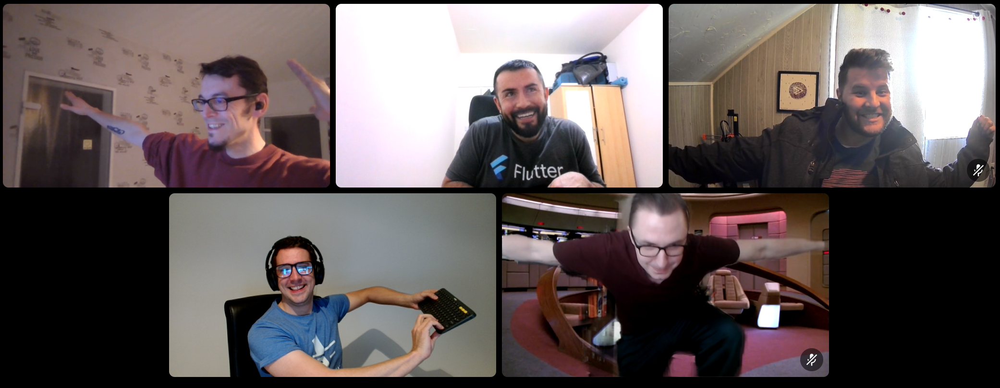

---
path: '2023/03/28/fantomas-six-legendary-formatter/'
date: '2023-03-28'
title: 'Fantomas 6: The Legendary Formatter'
tags: ['open-source', 'fsharp', 'fantomas', 'tooling' ]
cover: './blog.nojaf.com-fantomas-six-legendary-formatter.jpg'
backgroundPosition: 'initial'
---

## Introduction

Early this year we announced our plans for [Fantomas 6](https://github.com/fsprojects/fantomas/issues/2709).   
We are happy to announce that we have wrapped up the development of version 6 and a preview is now available on [NuGet](https://www.nuget.org/packages/fantomas/6.0.0-alpha-008).

### What's new?

Fantomas 6 is a major release and contains a lot of new features and improvements. In this post we will highlight some of the most important changes.

## Parallel formatting

Fantomas 6 is now able to format multiple files in parallel. This is a huge improvement for large projects.  
This happens out of the box and you don't have to do anything to benefit from this.

## A whole lot of Stroustrup

In recent months, the [Stroustrup style](https://en.wikipedia.org/wiki/Indentation_style#Variant:_Stroustrup) has been officially enlisted in the [FSharp style guide](https://github.com/dotnet/docs/pull/33171).
This means we want to support this style in Fantomas as a first class citizen.

```fsharp
let band = {
    Vocals = "John"
    Bass = "Paul"
    Guitar = "George"
    Drums = "Ringo"
}

let songs = [
    "Come Together"
    "Hey Jude"
    "Yesterday"
    "Yellow Submarine"
    "Here Comes the Sun"
]

type Record = {
    ReleaseDate : DateTime
    Title : string
    Artist : string
}
```

Enable this style by setting 

```
fsharp_multiline_bracket_style = stroustrup
```

in your `.editorconfig` file.

#### Computation expressions

Computation expressions are an interesting topic, on the one hand they are respecting `Stroustrup` style by themselves.
And on the other hand, they could also be formatted as `Stroustrup` in combination with a let binding.

```fsharp
let something =
    task {
        let! thing = otherThing ()
        return 5
    }

// versus

let something = task {
    let! thing = otherThing ()
    return 5
}
```

As we are a bit split on this topic, we decided to make this configurable.
By default, we will format computation expressions on the next line in a binding.
And you can enable control this behavior by setting

```
fsharp_newline_before_multiline_computation_expression = true
```

```fsharp
// Default: fsharp_newline_before_multiline_computation_expression = false
let something =
    task {
        let! thing = otherThing ()
        return 5
    }

// versus

// fsharp_newline_before_multiline_computation_expression = true
let something = task {
    let! thing = otherThing ()
    return 5
}
```

## Cursor API

When you are in the heat of writing code, you don't want to be bothered by formatting things manually.
Luckily, Fantomas can help you out with this. By formatting consistently, your raw code can jump around quite a bit.
And one side effect of that, is that your cursor will jump around as well.

In v6 we have added a new API for editors to be able to know where the cursor should be after formatting.
JetBrains Rider is the first editor to [support this API](https://github.com/JetBrains/resharper-fsharp/pull/484), and I suspect other editors will follow accordingly.
This should improve the overall experience of using Fantomas in your editor.

## Code generation

Fantomas can be used to [generate F&#x23; code](https://fsprojects.github.io/fantomas/docs/end-users/GeneratingCode.html). This feature has been around for quite some time, but it was a bit tricky to use.
Tricky, as in, you had to know how your way around the [untyped AST](https://fsprojects.github.io/fantomas/reference/fsharp-compiler-syntax.html) to generate the code.
The AST from the F&#x23; parser has historically always been a bit challenging to work with in Fantomas. Our use-case is slightly different than the compiler's and the tree we get is not always the most convenient to work with.

We addressed this trial by inducing our own syntax tree in ["Project Dallas"](../../../../2022/12/22/the-oak-sleeps-in-the-acorn/#project-dallas). In v6, we made those types public and added an API to generate code from them.
The result is that you can now generate code in a much more convenient way.

The old API:

```fsharp
#r "nuget: Fantomas.Core, 6.0-alpha-*"

open FSharp.Compiler.Text
open FSharp.Compiler.Xml
open FSharp.Compiler.Syntax
open FSharp.Compiler.SyntaxTrivia
open Fantomas.Core

let implementationSyntaxTree =
    ParsedInput.ImplFile(
        ParsedImplFileInput(
            "filename.fsx",
            true,
            QualifiedNameOfFile(Ident("", Range.Zero)),
            [],
            [],
            [ SynModuleOrNamespace(
                  [],
                  false,
                  SynModuleOrNamespaceKind.AnonModule,
                  [ SynModuleDecl.Let(
                        false,
                        [ SynBinding(
                              None,
                              SynBindingKind.Normal,
                              false,
                              false,
                              [],
                              PreXmlDoc.Empty,
                              SynValData(None, SynValInfo([], SynArgInfo([], false, None)), None),
                              SynPat.Named(SynIdent(Ident("a", Range.Zero), None), false, None, Range.Zero),
                              None,
                              SynExpr.Const(SynConst.Int32(0), Range.Zero),
                              Range.Zero,
                              DebugPointAtBinding.Yes Range.Zero,
                              { EqualsRange = Some Range.Zero
                                InlineKeyword = None
                                LeadingKeyword = SynLeadingKeyword.Let Range.Zero }
                          ) ],
                        Range.Zero
                    ) ],
                  PreXmlDoc.Empty,
                  [],
                  None,
                  Range.Zero,
                  { LeadingKeyword = SynModuleOrNamespaceLeadingKeyword.None }
              ) ],
            (false, false),
            { ConditionalDirectives = []
              CodeComments = [] },
            Set.empty
        )
    )

CodeFormatter.FormatASTAsync(implementationSyntaxTree) 
|> Async.RunSynchronously 
|> fun result -> printfn "%s" result.Code
```

The Oak API:

```fsharp
#r "nuget: Fantomas.Core, 6.0-alpha-*"

open FSharp.Compiler.Text
open Fantomas.Core
open Fantomas.Core.SyntaxOak

let implementationOak =
    Oak(
        [],
        [ ModuleOrNamespaceNode(
              None,
              [ BindingNode(
                    None,
                    None,
                    MultipleTextsNode([ SingleTextNode("let", Range.Zero) ], Range.Zero),
                    false,
                    None,
                    None,
                    Choice1Of2(IdentListNode([IdentifierOrDot.Ident(SingleTextNode("a", Range.Zero))], Range.Zero)),
                    None,
                    [],
                    None,
                    SingleTextNode("=", Range.Zero),
                    Expr.Constant(Constant.FromText(SingleTextNode("0", Range.Zero))),
                    Range.Zero
                )
                |> ModuleDecl.TopLevelBinding ],
              Range.Zero
          ) ],
        Range.Zero
    )

CodeFormatter.FormatOakAsync(implementationOak)
|> Async.RunSynchronously
|> printfn "%s"
```

Note that we do still support the old API, but we recommend using the new API instead.  

### Fabulous.AST

Even thought the Oak API simplifies generating code, it can still be a bit verbose. Depending on your use-case, you might want to generate code in a more declarative way.
For this, a new library called [Fabulous.AST](https://github.com/edgarfgp/Fabulous.AST) has been created. It is a library that will provide a nice DSL similar to other [Fabulous](https://docs.fabulous.dev/) projects.  
More on that in the near future.

## Verbose output

Fantomas always made a lot of noise when you ran it. We reported a line about start and finish of each file.
This can be useful, but it can also be a bit annoying. In v6, by default, we silenced this output.

v5:

```powershell
 ~#@❯  dotnet fantomas src -r
Processing src\fsc\fscmain.fs
'src\fsc\fscmain.fs' was unchanged
Processing src\FSharp.Build\CreateFSharpManifestResourceName.fs
'src\FSharp.Build\CreateFSharpManifestResourceName.fs' was unchanged
Processing src\FSharp.Build\Fsc.fs
'src\FSharp.Build\Fsc.fs' was unchanged
Processing src\FSharp.Build\FSharpCommandLineBuilder.fs
'src\FSharp.Build\FSharpCommandLineBuilder.fs' was unchanged
Processing src\FSharp.Build\FSharpEmbedResourceText.fs
'src\FSharp.Build\FSharpEmbedResourceText.fs' was unchanged
Processing src\FSharp.Build\FSharpEmbedResXSource.fs
'src\FSharp.Build\FSharpEmbedResXSource.fs' was unchanged
Processing src\FSharp.Build\Fsi.fs
'src\FSharp.Build\Fsi.fs' was unchanged
Processing src\FSharp.Build\InternalsVisibleTo.fs
'src\FSharp.Build\InternalsVisibleTo.fs' was unchanged
Processing src\FSharp.Build\MapSourceRoots.fs
...
```

v6:

```powershell
~#@❯  dotnet fantomas src
  Formatted │ 119 │ Ignored │ 99 │ Unchanged │ 183 │ Errored │ 0
```

If you want to see the verbose output, you can use the `--verbose` (or `-v`) flag.

## Miscellaneous

### Public API

The `CodeFormatter` module represents the public API of `Fantomas.Core`. We tweaked the API a bit to make it more consistent.

### Deprecations

- Settings `fsharp_multiline_block_brackets_on_same_column` and `fsharp_experimental_stroustrup_style` have been deprecated.
  You can use `fsharp_multiline_bracket_style` instead. Accepting `cramped` (default), `aligned` and `stroustrup`.
- `--recursive` is no longer available on the command line. We will process all files in the given directory recursively by default.
  If you want to excluded any files or directories, you can use a [.fantomasignore](https://fsprojects.github.io/fantomas/docs/end-users/IgnoreFiles.html) file.

## Last call for feedback

Currently, v6 is still marked as alpha. The reason for this is that we will want to accept any feedback before we release v6 as stable.
Once we label it as beta, we will not accept any breaking changes anymore. That is why we are giving the community some more time to test v6 and give us feedback.

## Acknowledgements

Fantomas v6 is a remarkable achievement as many people have contributed to it. I believe this might be the first big release where I didn't contribute the majority of the code.
Which is a very healthy sign for the project.

I would like to thank the following people in particular for their contributions:
- [Josh DeGraw](https://github.com/sponsors/josh-degraw) for all his effort around the Stroustrup style. Both in the style guide and Fantomas!
- [David Schaefer](https://github.com/sponsors/dawedawe) for his work on the command line output, many pull request review and various tweaks!
- [Jimmy Byrd](https://github.com/sponsors/TheAngryByrd) for taking a crack at parallel formatting in the command line tool!
- [Edgar Gonzalez](https://github.com/sponsors/edgarfgp) for exposing the `Oak` model and dogfooding it.
- [Alex Berezhnykh](https://github.com/DedSec256) for his collaboration on the Cursor API. 

<div class="text-center my-4">

<small>The Fantomas crew having some fun during a <a href="https://discord.gg/D5QXvQrBVa">Discord</a> call</small>
</div>

Happy formatting,

Florian

Photo by <a href="https://unsplash.com/@parmanand?utm_source=unsplash&utm_medium=referral&utm_content=creditCopyText">Parmanand Jagnandan</a> on <a href="https://unsplash.com/photos/3z0fVrHkXOM?utm_source=unsplash&utm_medium=referral&utm_content=creditCopyText">Unsplash</a>