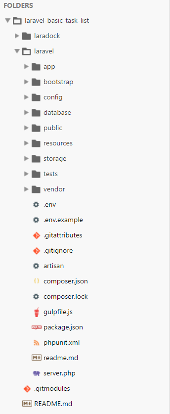

## Introduction

Nowadays I'm into PHP & Docker. Yep that's right this .NET boy is going wild!

As I'm learning all these new concepts it became clear that you don't really start from scratch with PHP but you choose a framework.

I ended up choosing Laravel because it is popular, has a beautiful website and there is this thing called [Laracasts](https://laracasts.com/).

> Laracasts - It's Kinda Like Netflix for Your Career!

### Basic Task List

In this blogpost we're going to create the [Basic Task List](https://laravel.com/docs/5.2/quickstart) example from the Laravel documentation using [LaraDock](https://github.com/LaraDock/laradock) instead of [Homestead](https://laravel.com/docs/5.2/homestead) on Vagrant.

To get started I assume:

*   you have installed Docker
*   you have a general idea what Docker is and how it works
*   you're on Windows just like me.

## Getting started

Open a PowerShell window and create a new project folder.

    PS MyUser\Projects>mkdir laravel-basic-task-list

_ProTip: start using [Terminal Wings](https://www.phrozensoft.com/2016/02/terminal_wings-12), it's super fancy_

Enter the newly created folder

    PS MyUser\Projects>cd laravel-basic-task-list
    PS MyUser\Projects\laravel-basic-task-list>git init

Add LaraDock as a [git-submodule]( https://git-scm.com/docs/git-submodule)

    PS MyUser\Projects\laravel-basic-task-list>git submodule add https://github.com/LaraDock/laradock.git laradock

We'll make some slight changes to the `laradock\docker-compose.yaml` file:

*   Change the Nginx port forwarding from `80:80` to `8300:80` to avoid any possible collisions with IIS.
*   Change the volumes mapping in the _Laravel Application Code Container_ from `../:/var/www/laravel` to `../laravel/:/var/www/laravel`.

We basically want the following in our project folder:

     laravel-basic-task-list>
         laradock ~> git submodule
         laravel ~> our laravel installation folder

We didn't install anything yet so let's just create an empty `laravel` folder:

    PS MyUser\Projects\laravel-basic-task-list>mkdir laravel

## Firing up Docker

For the tutorial we need to list two containers: **nginx** and **mysql**.  
Let's move back to the laradock folder (since our docker-compose file is there) and create our containers:

    PS MyUser\Projects\laravel-basic-task-list\laradock>docker-compose up -d nginx mysql

This will create all the necessary container and run three containers in the background.  
These being nginx, mysql and the workspace container.  
Verify this by using _docker-compose ps_

    PS MyUser\Projects\laravel-basic-task-list\laradock>docker-compose ps
    Name                        Command             State                      Ports
    ------------------------------------------------------------------------------------------------
    laradock_mysql_1            docker-entrypoint.sh mysqld   Up       0.0.0.0:3306->3306/tcp
    laradock_nginx_1            nginx                         Up       0.0.0.0:443->443/tcp, 0.0.0.0:8300->80/tcp
    laradock_php-fpm_1          php-fpm                       Up       9000/tcp
    laradock_volumes_data_1     true                          Exit 0
    laradock_volumes_source_1   true                          Exit 0
    laradock_workspace_1        /sbin/my_init                 Up

So far so good. If you now browse to [http://localhost:8300](http://localhost:8300) you should get a 404 page by Nginx.  
This is expected since we didn't install anything yet.

## Taking control

Ok, now let's install Laravel using our workspace container.

> Enter the Workspace container, to execute commands like (Artisan, Composer, PHPUnit, Gulp, ...).

    PS MyUser\Projects\laravel-basic-task-list\laradock>docker exec -it laradock_workspace_1 bash

Now we can run bash commands inside the workspace container. We'll use Composer to create our new Laravel project.

    root@81acfe2e1e76:/var/www/laravel# composer create-project laravel/laravel .

This will install Laravel inside our laravel folder.  
Open up the project folder in a text editor. It should look somewhat like this:

Browsing to [http://localhost:8300](http://localhost:8300) should return the Laravel welcome page.

## Wiring up the database

Open the _.env_ file. We need to tell Laravel that we are using the mysql container as MySql server.  
So change `DB_HOST=localhost` to `DB_HOST=mysql`.

We can quickly check if this all works by running the default migrations

    root@81acfe2e1e76:/var/www/laravel# php artisan migrate

At this point we are good to go to follow along the [tutorial](https://laravel.com/docs/5.2/quickstart#prepping-the-database).

## Connecting to the database

Assuming we completed the exercise, let's take a look at our tasks table in the database.  
Exit the workspace container and enter the mysql container

    root@81acfe2e1e76:/var/www/laravel# exit
    PS MyUser\Projects\laravel-basic-task-list\laradock>docker exec -it laradock_mysql_1 bash
    root@ebc73025ab6f:/# mysql --user=homestead --password=secret homestead

To view our tables:

     mysql> show tables;

(mind the **;**)

Our tasks:

    mysql> select * from tasks;
    +----+---------+---------------------+---------------------+
    | id | name    | created_at          | updated_at          |
    +----+---------+---------------------+---------------------+
    |  2 | test    | 2016-08-15 19:23:07 | 2016-08-15 19:23:07 |
    |  4 | foobar  | 2016-08-15 19:23:15 | 2016-08-15 19:23:15 |
    |  5 | 2-tests | 2016-08-15 19:28:13 | 2016-08-15 19:28:13 |
    |  6 | Foobar  | 2016-08-16 16:43:47 | 2016-08-16 16:43:47 |
    +----+---------+---------------------+---------------------+

## Remarks

*   I'm using Docker 1.12.0 (stable) on the Windows 10 Anniversary Update
*   I'm still learning Docker, PHP, Laravel, ... so this is more _a_ guide not the _ultimate guide_.
*   I really, really like the fact that I didn't have to install anything to get Laravel up and running

## Final words

I hope you enjoyed this blogpost and it all makes sense. If you have any suggestions or questions please leave a comment.

Yours truly,  
nojaf