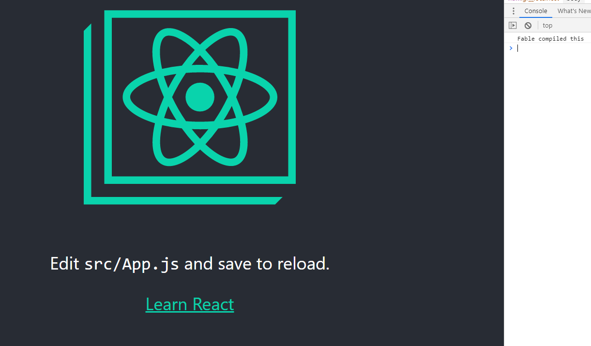
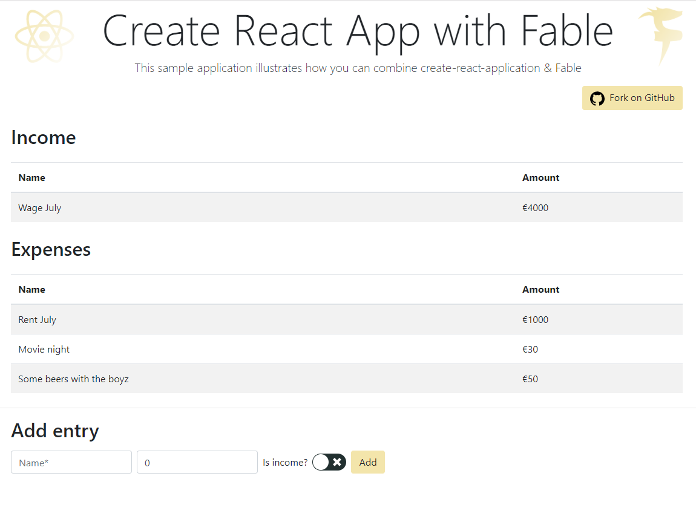

## Introduction

2019 has been a great year for me for all things F# related! I helped out with the organization of [FableConf in Antwerp](https://axxes.com/en/net-2-en/axxes-proud-host-of-fableconf-2019/), gave a [webinar at JetBrains](https://blog.jetbrains.com/dotnet/2019/07/24/webinar-from-fsharp-to-javascript-with-fable/) and was able to release [Fantomas 3.0](https://axxes.com/en/net/fantomas-3-0-over-and-above/).
To wrap up the decade I'm writing this post as part of the **[F# Advent Calendar in English 2019](https://sergeytihon.com/2019/11/05/f-advent-calendar-in-english-2019/)**.<br/>
I had fun [last year](/2018/12/17/writing-a-vscode-extension-with-fable-2-1/) and I wish to continue this trend.

### To Feliz or not to Feliz

[Feliz](https://zaid-ajaj.github.io/Feliz/) has been receiving some traction in the community and at one-point Zaid asked me what I thought about it.
My reply was, well it's not for everybody 😅.
In this blog post I'm going to explore yet another alternative of creating views in Elmish, by using React as is.

### TL;DR

In blog post we are going to combine [Fable](https://fable.io/) with [Create React App](https://create-react-app.dev/).
Writing our **views with vanilla React** components and our **logic in F#**.

## Capital Guardian

Recently I've had the need to track where my money is going. Or as we say in Belgium, there is a hole in my wallet somehow.
Obviously, using an existing online tool is too easy so I decided to build something myself.

The domain is a bit more complex than you would think at first glance. The basics are simple, I earn money and I spend it.
Capture all those transactions and you know the balance. However, some expenses are recurring or sometimes you want to spread an bigger expense over multiple months.
Anyway, we aren't going to cover the entire application, but you can sort of see where this could go.<br />
It is technically challenging enough to serve as a good exercise in domain modeling and **event sourcing**.

### Architecture

Since we are doing event sourcing I'm eager to use **Azure Functions** and [Cosmo store](https://github.com/Dzoukr/CosmoStore) for the back-end.
Nonetheless, this post is about the front-end and we will focus solely on that.

## Create React App and Fable

As mentioned, the first thing we want to do is scaffold a new project with Create React App.<br />
I'm a Yarn guy, so:

> yarn create react-app capital-guardian

_Create React Application_ has amazing documentation and the key takeaway here is that I don't have to do any crazy webpack shizzle.
It just works &copy; and I don't have to maintain anything. 

### Compiling FSharp

There are a few moving pieces in setting up the front-end development experience.
The F# files should be compiled to ES6 JavaScript before the React development server starts.
We can solve this problem using a FAKE script.

### Paket

First let's install some .NET Core 3 tools. 
Let's use the new and [shiny Paket 6](http://www.navision-blog.de/blog/2019/12/02/announcing-paket-6-alpha/)!
Paket is useful in this case because we are using FAKE and will compile [F# scripts with Fable](https://axxes.com). // TODO: add link to axxes blog

> dotnet new tool-manifest
>
> dotnet tool install paket
>
> dotnet tool install fake-cli

Setup our .NET dependencies:

> dotnet paket init

Change `paket.dependencies` to

```
group client
storage:none
source: https://api.nuget.org/v3/index.json
framework: netstandard2.0

nuget Fable.React
nuget Fable.Elmish
nuget Fable.Promise
nuget Fable.Fetch
nuget Thoth.Json

group build
storage:none
source: https://api.nuget.org/v3/index.json
framework: netstandard2.0
nuget Fake.Core.Target
nuget Fake.IO.FileSystem
nuget Fake.JavaScript.Yarn
nuget Fake.DotNet.Paket
nuget Fantomas
```

And install everything with:

> dotnet paket install

### FAKE

Next, create a `build.fsx` script:

```fsharp
#r "paket: groupref build //"
#load ".fake/build.fsx/intellisense.fsx"

open Fake.Core
open Fake.Core.TargetOperators
open Fake.DotNet
open Fake.IO
open Fake.IO.FileSystemOperators
open Fake.IO.Globbing.Operators
open Fake.JavaScript
open System
open Fantomas.FakeHelpers
open Fantomas.FormatConfig

let clientPath = Path.getFullName "./"
let setYarnWorkingDirectory (args: Yarn.YarnParams) = { args with WorkingDirectory = clientPath }

module Paket =
    let private runCmd cmd args =
        CreateProcess.fromRawCommand cmd args
        |> Proc.run
        |> ignore

    let private paket args = runCmd "dotnet" ("paket" :: args)

    let ``generate load script``() = paket [ "generate-load-scripts"; "-f"; "netstandard2.0"; "-t"; "fsx" ]

Target.create "Clean" (fun _ ->
    Shell.rm_rf (clientPath </> ".fable")
    Shell.rm_rf (clientPath </> "src" </> "bin"))

Target.create "Yarn" (fun _ -> Yarn.installPureLock setYarnWorkingDirectory)

Target.create "Paket" (fun _ ->
    Paket.restore id
    Shell.rm_rf (".paket" </> "load")
    Paket.``generate load script``())

Target.create "Build" (fun _ -> Yarn.exec "build" setYarnWorkingDirectory)

"Clean" ==> "Paket" ==> "Yarn" ==> "Build"

Target.runOrDefault "Build"
```

As a first version of our build script we can install our dependencies and build our application.
Notice the little helper module to [generate the load script](https://fsprojects.github.io/Paket/paket-generate-load-scripts.html).
Keep in mind that nothing Fable related is in place yet.

### Fable

Install `fable-splitter` &amp; `fable-compiler` and add a script to our package.json to start the splitter.

```json
{
  "name": "capital-guardian",
  "version": "0.1.0",
  "private": true,
  "dependencies": {
    "fable-compiler": "^2.4.11",
    "fable-splitter": "^2.1.11",
    "react": "^16.12.0",
    "react-dom": "^16.12.0",
    "react-scripts": "3.2.0"
  },
  "scripts": {
    "start": "react-scripts start",
    "build": "react-scripts build",
    "test": "react-scripts test",
    "eject": "react-scripts eject",
    "fable": "fable-splitter fsharp/Main.fsx -o src/bin",
    "prebuild": "yarn fable"
  }
}
```

Then create `Main.fsx` in a `fsharp` folder.

```fsharp
#load "../.paket/load/netstandard2.0/client/client.group.fsx"

printfn "Fable compiled this"
```

Running `yarn fable` now compiles the F# to `src/bin`.

> yarn add fable-splitter fable-compiler

Add `import './bin/Main';` to `App.js` and start the development server using `yarn start`.

### Adjust Create React App

And just like that:


Well _Create React Application_ does JavaScript linting as well and it is rejecting the compiled F# code.
Or at least a part of the `Fable.Core` library in this case.
We want to tell the linter that it should ignore the `src/bin` folder.

Create an `.eslintignore` file and add `src/bin/**` to it.
For the ignore file to be picked up add an `.env` file with `EXTEND_ESLINT=true`.



Great! At this point running `dotnet fake run build.fsx` will compile the F# and create a production build of Create React App.

###  Watch mode

`fable-splitter` has a watch mode, however using this can lead some chicken and egg type of problem.
If the F# has never been compiled and _Create React Application_ is started it will fail. A possible solution could be to compile the F#, start _Create React Application_ and then compile F# in watch mode.
Unfortunately, this is an expensive operation (we would start the Fable daemon twice). A workaround can be created in our build script.

```fsharp
Target.create "Watch" (fun _ ->
    let fableOutput output =
        Trace.tracefn "%s" output
        if output = "fable: Watching..." then
            Yarn.exec "start" setYarnWorkingDirectory

    let fableError output = Trace.traceErrorfn "\n%s\n" output

    let compileFable =
        CreateProcess.fromRawCommand Yarn.defaultYarnParams.YarnFilePath ["fable";"--watch"]
        |> CreateProcess.withWorkingDirectory clientPath
        |> CreateProcess.redirectOutput
        |> CreateProcess.withOutputEventsNotNull fableOutput fableError
        |> Proc.startAndAwait
        |> Async.Ignore

    Async.RunSynchronously compileFable)

"Clean" ==> "Paket" ==> "Yarn" ==> "Build"

"Paket" ==> "Yarn" ==> "Watch"

Target.runOrDefault "Build"
```

Admittedly this is a bit of hack, first we start the splitter process and read all the output.
If the output says `fable: Watching...`, it means the initial JavaScript was emitted (to `src/bin`) and will continue to watch our F# files.
Once we have that initial JavaScript output, we can start _Create React Application_.

Any changes to either `*.js` or  `*.fsx` files will trigger a browser reload and this provides us a rich developer experience.

## Enter Elmish

We wish to use `Fable.Elmish` for the purpose of what React Redux is commonly used for.

position it like how [React Redux](https://react-redux.js.org/) works.
A top-level component will contain all the state and expose actions and selections via hooks.

### React Context

First, we need a wrapper component that will start an **Elmish program**.

```fsharp
#load "../.paket/load/netstandard2.0/client/client.group.fsx"

open Elmish
open System
open Fable.React
open Fable.Core

type Amount = double

type Year = int

type Month = int

type Id = Guid

type Transaction =
    { Name: string
      Amount: Amount
      Rule: Id option
      Created: DateTime }

type RecurringRule = Id * string * Amount

type ProcessedRecurringRule = Id * Year * Month

type Event =
    | AddExpense of Transaction
    | AddIncome of Transaction
    | AddRecurringIncomingRule of RecurringRule
    | AddRecurringExpenseRule of RecurringRule
    | CancelRecurringRule of Id * DateTime

let private sampleEvents =
    let rentRuleId = Guid.Parse("92C3A64D-EE6E-4536-9A83-04682D21E3F2")
    let wageId = Guid.Parse("DD860AB1-5A07-49D7-831D-4723C1DB8284")
    let now = DateTime.Now

    [ AddRecurringExpenseRule(rentRuleId, "Rent", 800.)
      AddRecurringIncomingRule(wageId, "Wage", 3000.)
      AddExpense
          ({ Name = "Rent July"
             Amount = 1000.
             Rule = Some rentRuleId
             Created = now })
      AddIncome
          ({ Name = "Wage July"
             Amount = 4000.
             Rule = Some wageId
             Created = now })
      AddExpense
          ({ Name = "Movie night"
             Amount = 30.
             Rule = None
             Created = now })
      AddExpense
          ({ Name = "Some beers with the boyz"
             Amount = 50.
             Rule = None
             Created = now }) ]

type Msg =
    | AddIncome of Transaction
    | AddExpense of Transaction
    | LoadEvents
    | EventsLoaded of Event list
    | NetworkError of exn

type Model =
    { Events: Event list
      IsLoading: bool }

let private fetchEvents() =
    promise {
        do! Promise.sleep 500
        return sampleEvents
    }

let private postEvents events _ = printfn "Posting events %A to the backend" events

let private init _ =
    { IsLoading = true
      Events = [] }, Cmd.OfPromise.either fetchEvents () EventsLoaded NetworkError

let private update (msg: Msg) (model: Model) =
    JS.console.log msg
    match msg with
    | EventsLoaded events ->
        { model with
              Events = events
              IsLoading = false }, Cmd.none
    | AddIncome event
    | AddExpense event ->
        { model with Events = (Event.AddIncome event) :: model.Events }, Cmd.ofSub (postEvents [ event ])

    | _ -> failwithf "Msg %A not implemented" msg

[<NoComparison>]
type AppContext =
    { Model: Model
      Dispatch: Dispatch<Msg> }

let private defaultContextValue: AppContext = Fable.Core.JS.undefined
let appContext = ReactBindings.React.createContext (defaultContextValue)

let ElmishCapture =
    FunctionComponent.Of
        ((fun (props: {| children: ReactElement; loading: ReactElementType |}) ->

            let initialModel = init() |> fst

            let state: IStateHook<AppContext> =
                Hooks.useState
                    ({ Model = initialModel
                       Dispatch = ignore })

            let isMounted = Hooks.useState (false)

            let view model dispatch =
                state.update
                    ({ Model = model
                       Dispatch = dispatch })

            Hooks.useEffect
                ((fun () ->
                    isMounted.update (true)
                    Program.mkProgram init update view |> Program.run), Array.empty)

            if isMounted.current
            then contextProvider appContext state.current [ props.children ]
            else ReactBindings.React.createElement (props.loading, null, [])),

         "ElmishCapture", memoEqualsButFunctions)
```

The `ElmishCapture` will start the `Program` once it has been mounted. Then the view function captures `Model` and `Dispatch` in the component's local state.
And that state is being passed as argument for the `AppContext`.
Check out [React Context](https://reactjs.org/docs/context.html) to learn more.

### Usage in React

```jsx
import React from 'react';
import './App.css';
import './bin/Main';
import { ElmishCapture } from './bin/Main';

const Loading = () => <p>loading...</p>

function App() {
  return (
    <ElmishCapture loading={Loading}>
      <div className="App">
        My App here
      </div>
    </ElmishCapture>
  );
}

export default App;
```

Fable splitter compiles our code to `src/bin`, so now we can wrap the existing `<App />` with `ElmishCapture`.

### Hooks

How do we access the `Model` and `Dispatch` directly? The answer here lies within [React Hooks](https://reactjs.org/docs/hooks-intro.html).

```fsharp
let private useModel() =
    let { Model = model } = Hooks.useContext (appContext)
    model

let private useDispatch() =
    let { Dispatch = dispatch } = Hooks.useContext (appContext)
    dispatch
```

#### Dispatching messages

Be that as it may, we are not going to access the `Model` and `Dispatch`directly. Creating a `Msg` in JavaScript is hard because the output of the Fable isn't really that nice.

For example:
```fsharp
open System

type Amount = double
type Year = int
type Month = int
type Id = System.Guid

type Transaction =
    { Name: string
      Amount: Amount
      Rule: Id option
      Created: DateTime }

type Msg =
    | AddIncome of Transaction
    | AddExpense of Transaction

let myExpense =
    Msg.AddExpense
          ({ Name = "Movie night"
             Amount = 30.
             Rule = None
             Created = DateTime.Now })
```

is compiled to 
```fsharp
import { Union, declare, Record } from "fable-library/Types.js";
import { union, record, option, type, float64, string } from "fable-library/Reflection.js";
import { now } from "fable-library/Date.js";
export const Transaction = declare(function Test_Transaction(arg1, arg2, arg3, arg4) {
  this.Name = arg1;
  this.Amount = arg2;
  this.Rule = arg3;
  this.Created = arg4;
}, Record);
export function Transaction$reflection() {
  return record("Test.Transaction", [], Transaction, () => [["Name", string], ["Amount", float64], ["Rule", option(type("System.Guid"))], ["Created", type("System.DateTime")]]);
}
export const Msg = declare(function Test_Msg(tag, name, ...fields) {
  Union.call(this, tag, name, ...fields);
}, Union);
export function Msg$reflection() {
  return union("Test.Msg", [], Msg, () => [["AddIncome", [Transaction$reflection()]], ["AddExpense", [Transaction$reflection()]]]);
}
export const myExpense = new Msg(1, "AddExpense", new Transaction("Movie night", 30, null, now()));
```

The `new Msg(1, "AddExpense", new Transaction("Movie night", 30, null, now()));` part isn't really what we want to write ourselves here.
It would be better to encapsulate this in a hook.

```fsharp
let useAddEntry() =
    let dispatch = useDispatch()
    fun (input: {| name: string; amount: Amount; isIncome: bool |}) ->
        let today = DateTime.Now

        let entry =
            { Name = input.name
              Amount = input.amount
              Rule = None
              Created = today }

        let msg =
            if input.isIncome then AddIncome entry else AddExpense entry

        dispatch msg
```

This hook returns function that can be called in function component.

```jsx
const HomePage = () => {
    const addEntry = useAddEntry();
    const onClick = () => { addEntry({ "name": "My new entry", 
                                       "amount": 35, 
                                       "isIncome": false  }); }
    return <p>imagine a form here...<br />
              <button onClick={onClick}>submit</button></p>
};
```

Yet there is another problem.
When we create a function in Fable that returns a function it doesn't compile to what we think it would.

For example:
```fsharp
let a () = fun b -> b
```

compiles to
```js
export function a(unitVar0, b) {
  return b;
}
```

So, when calling the function `a`, it will immediately be executed.
To overcome this we can wrap the lambda in a `System.Func<_,_>`.

```fsharp
let a () = System.Func<_,_>(fun b -> b)
``` 
so that it compiles to
```js
export function a() {
  return function (b) {
    return b;
  };
}
```

We can write a little helper function to make everything less verbose:

```fsharp
let private f g = System.Func<_, _>(g)

let useAddEntry() =
    let dispatch = useDispatch()
    fun (input: {| name: string; amount: Amount; isIncome: bool |}) ->
        let today = DateTime.Now

        let entry =
            { Name = input.name
              Amount = input.amount
              Rule = None
              Created = today }

        let msg =
            if input.isIncome then AddIncome entry else AddExpense entry

        dispatch msg
    |> f
```

#### Reading fragments of the Model

Accessing the `Model` is very straightforward.
We can project the `Model` in F# to match the shape we need for the presentation.

```fsharp
let useEntries() =
    let { Events = events } = useModel()

    let sortMapAndToArray (input: Transaction seq) =
        input
        |> Seq.sortBy (fun ai -> ai.Created)
        |> Seq.map (fun ai ->
            {| name = ai.Name
               amount = ai.Amount |})
        |> Seq.toArray

    let income =
        events
        |> Seq.choose (function
            | Event.AddIncome(ai) when (Projections.isInCurrentMonth ai.Created) -> Some ai
            | _ -> None)
        |> sortMapAndToArray

    let expenses =
        events
        |> Seq.choose (function
            | Event.AddExpense(ae) when (Projections.isInCurrentMonth ae.Created) -> Some ae
            | _ -> None)
        |> sortMapAndToArray

    (income, expenses)
```

Which then later can be used in:

```jsx
import React from "react";
import { Container } from "reactstrap";
import { EntryList, Header, Loader, EntryForm } from "../components";
import { useEntries, useIsLoading, useAddEntry } from "../bin/Main";

const HomePage = () => {
  const [income, expenses] = useEntries();
  const isLoading = useIsLoading();
  const addEntry = useAddEntry();
  const body = (
    <div>
      <Header />
      <Container className={"my-4"}>
        <h2>Income</h2>
        <EntryList entries={income} />
        <h2>Expenses</h2>
        <EntryList entries={expenses} />
      </Container>
      <hr />
      <Container>
        <h2>Add entry</h2>
        <EntryForm onSubmit={addEntry} />
      </Container>
    </div>
  );

  return isLoading ? <Loader /> : body;
};

export default HomePage;
```

## Formatting

Great, it looks like everything is place now. We can access the model, dispatch messages and manage the state in F#.
To wrap up, I want to extend the build script to format all the code.

For the JavaScript I'm going to use [Prettier](https://prettier.io/) and for F# I can use [Fantomas](https://github.com/fsprojects/fantomas).

### Prettier

Prettier is very straightforward, add it with Yarn and create a script in the `package.json`.

> yarn add prettier

```json
{
  "name": "capital-guardian",
  "version": "0.1.0",
  "private": true,
  "dependencies": {
    "fable-compiler": "^2.4.11",
    "fable-splitter": "^2.1.11",
    "prettier": "^1.19.1",
    "react": "^16.12.0",
    "react-dom": "^16.12.0",
    "react-scripts": "3.2.0"
  },
  "scripts": {
    "start": "react-scripts start",
    "build": "react-scripts build",
    "test": "react-scripts test",
    "eject": "react-scripts eject",
    "fable": "fable-splitter fsharp/Main.fsx -o src/bin",
    "prebuild": "yarn fable",
    "format": "prettier ./src/**/*.js --write"
  }
}
```

We don't want Prettier to format the code generated by Fable.
To avoid this, add an `.prettierignore` file with `src/bin`.

### Fantomas

Fantomas can easily be used in a FAKE target.

```fsharp
open Fake.IO.Globbing.Operators
open Fantomas.FakeHelpers
open Fantomas.FormatConfig

Target.create "Format" (fun _ ->
    let fantomasConfig =
        { FormatConfig.Default with
              ReorderOpenDeclaration = true
              KeepNewlineAfter = true }

    let fsharpFiles = !!(clientPath </> "fsharp" </> "*.fsx")
        
    fsharpFiles
    |> formatCode fantomasConfig
    |> Async.RunSynchronously
    |> printfn "Formatted F# files: %A"

    Yarn.exec "format" setYarnWorkingDirectory)
```

Trigger it with `dotnet fake run build.fsx -t Format` and both languages will be handled.

## The source

You can find the source on my [GitHub](https://github.com/nojaf/capital-guardian/tree/blogpost).<br />
Notice that the code for this blog post is preserved in the `blogpost` branch.

The master branch will be used to finish the application.<br />
At the time of writing I still have these intentions 😄.

The `blogpost` branch also contains some additional setup for the back-end.
And it is fleshed out to have a first usable functionality.



## Final words

I don't believe the Mandalorian would say *"This is the way"*, in terms of this approach.
There are pros and cons to it and it certainly is not a silver bullet.

### Pros

- Much easier to use the vast existing JavaScript ecosystem. I've used [reactstrap](https://reactstrap.github.io/), [react-form-hook](https://react-hook-form.com/), [yup](https://github.com/jquense/yup), [react-switch](https://react-switch.netlify.com/) without the need of writing a single binding file.
- No need for any webpack stuff! For me this is a big win, even when I wanted to use Sass the documentation of _Create React Application_ was dead simple and it a minute later everything was up and running.
- Tooling for React is vastly superior. I'm using Rider and all the good magic of WebStorm for React components is available for me.
- The formatting story is nicer, Fantomas is not that good with formatting Elmish views. I'm aware of this and it is just hard to get right. So, I'm happy that I can use Prettier for that.

### Cons

- Part of the application is no longer statically typed. It provides speed but a what cost, right?
- The initial setup is rather time consuming. Doing the whole FAKE setup to have everything in place took some time. However, I really enjoyed it so I didn't really mind.
- The output of the console is less clear. Since we are using two processes to compile all the code to JavaScript, it can get hard to spot what is going wrong from time to time. Create React Application has the habit of clearing the screen when it compiles. 
Consequentially, you need to scroll to see the F# error you might have.

Overall, I like this, and time will tell if this ends up to be my new default or not.
Thanks for reading this far and I hope you enjoy the rest the of **F# Advent calendar**!

Yours truly,  
nojaf

Photo by <a style="background-color:black;color:white;text-decoration:none;padding:4px 6px;font-family:-apple-system, BlinkMacSystemFont, &quot;San Francisco&quot;, &quot;Helvetica Neue&quot;, Helvetica, Ubuntu, Roboto, Noto, &quot;Segoe UI&quot;, Arial, sans-serif;font-size:12px;font-weight:bold;line-height:1.2;display:inline-block;border-radius:3px" href="https://unsplash.com/@aditya1702?utm_medium=referral&amp;utm_campaign=photographer-credit&amp;utm_content=creditBadge" target="_blank" rel="noopener noreferrer" title="Download free do whatever you want high-resolution photos from Aditya Vyas"><span style="display:inline-block;padding:2px 3px"><svg xmlns="http://www.w3.org/2000/svg" style="height:12px;width:auto;position:relative;vertical-align:middle;top:-2px;fill:white" viewBox="0 0 32 32"><title>unsplash-logo</title><path d="M10 9V0h12v9H10zm12 5h10v18H0V14h10v9h12v-9z"></path></svg></span><span style="display:inline-block;padding:2px 3px">Aditya Vyas</span></a>