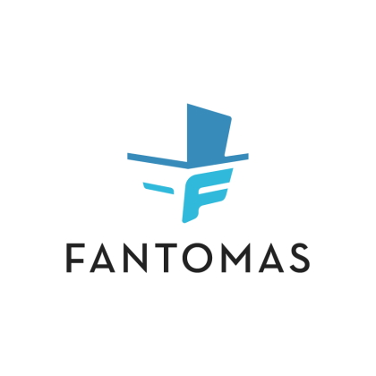
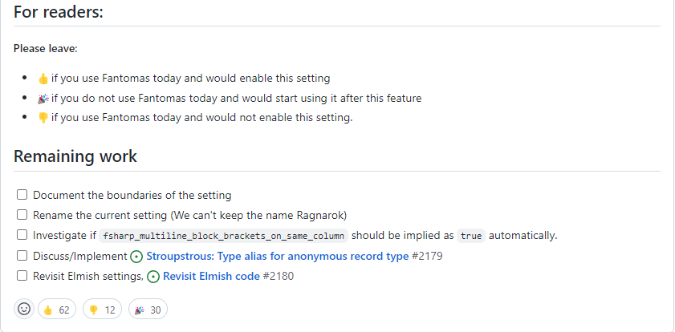

## Intro

Last week, I was able to merge in a [huge refactoring effort](https://github.com/fsprojects/fantomas/pull/2218) into [the next major version of Fantomas](https://github.com/fsprojects/fantomas/issues/2160).  
The result of these changes make Fantomas **at least twice as fast as the v4 release**.

*Before*

```
BenchmarkDotNet=v0.13.1, OS=ubuntu 20.04
Intel Xeon Platinum 8171M CPU 2.60GHz, 1 CPU, 2 logical and 2 physical cores
.NET SDK=6.0.200
  [Host]     : .NET 6.0.2 (6.0.222.6406), X64 RyuJIT DEBUG
  DefaultJob : .NET 6.0.2 (6.0.222.6406), X64 RyuJIT


| Method |    Mean |    Error |   StdDev | Rank |      Gen 0 |      Gen 1 |     Gen 2 | Allocated |
|------- |--------:|---------:|---------:|-----:|-----------:|-----------:|----------:|----------:|
| Format | 2.434 s | 0.0415 s | 0.0388 s |    1 | 92000.0000 | 33000.0000 | 2000.0000 |      2 GB |
```

*After*

```
BenchmarkDotNet=v0.13.1, OS=ubuntu 20.04
Intel Xeon Platinum 8272CL CPU 2.60GHz, 1 CPU, 2 logical and 2 physical cores
.NET SDK=6.0.200
  [Host]     : .NET 6.0.2 (6.0.222.6406), X64 RyuJIT DEBUG
  DefaultJob : .NET 6.0.2 (6.0.222.6406), X64 RyuJIT


| Method |     Mean |   Error |  StdDev | Rank |      Gen 0 |     Gen 1 |     Gen 2 | Allocated |
|------- |---------:|--------:|--------:|-----:|-----------:|----------:|----------:|----------:|
| Format | 594.4 ms | 6.98 ms | 6.53 ms |    1 | 12000.0000 | 4000.0000 | 1000.0000 |    207 MB |
```

In this blogpost, I'll elaborate a bit how we did this and what you can expect from the V5 release.

## F# eXchange 2021

Last October, I had the opportunity to speak at [F# eXchange](https://skillsmatter.com/skillscasts/17236-fantomas-v).
There I announced that what the plan was for the next major of Fantomas and how to get there.
A crucial part of that talk was about how improving the `Syntax tree` at [dotnet/fsharp](https://github.com/dotnet/fsharp/blob/main/src/fsharp/SyntaxTree.fsi) was the key to everything.
In short, a better syntax tree, leads to less shenanigans in the Fantomas codebase.

> In short, a better syntax tree, leads to less shenanigans in the Fantomas codebase.

## Trivia

A significant part of improving the syntax tree was the introduction of [Trivia](https://github.com/dotnet/fsharp/issues/12418).
`Trivia` has a bit of dual meaning:
- In Fantomas, we use it as a denominator for additional information that was present in the source code, but not captured in the AST. For example code comments or newlines.
- In the F# compiler, we use it as a denominator for addition information about syntax, that the compiler doesn't need to compile to binary. For example the range of the `let` keyword in a binding.

Having [additional trivia information](https://github.com/dotnet/fsharp/blob/main/src/fsharp/SyntaxTree.fsi) in the syntax tree is of immense value to Fantomas.

### Keywords

Having more information about keyword allows us to better release what the user originally wrote.
If we take a look at the AST for

```fsharp
type MyType =
    abstract One : unit -> unit
    abstract member Two: unit -> unit
```

we get something along the lines of

```fsharp
Types
 ([SynTypeDefn
     (SynComponentInfo
        ([], None, [], [MyType],
         PreXmlDoc ((1,0), FSharp.Compiler.Xml.XmlDocCollector),
         false, None, tmp.fsx (1,5--1,11)),
      ObjectModel
        (Unspecified,
         [AbstractSlot
            (SynValSig
               ([], SynIdent (One, None), ...
             { IsInstance = true
               IsDispatchSlot = true
               IsOverrideOrExplicitImpl = false
               IsFinal = false
               MemberKind = Member
               Trivia = { MemberRange = None
                          OverrideRange = None
                          AbstractRange = Some tmp.fsx (2,4--2,12)
                          StaticRange = None
                          DefaultRange = None } },
             tmp.fsx (2,4--2,31));
          AbstractSlot
            (SynValSig
               ([], SynIdent (Two, None), ...
             { IsInstance = true
               IsDispatchSlot = true
               IsOverrideOrExplicitImpl = false
               IsFinal = false
               MemberKind = Member
               Trivia = { MemberRange = Some tmp.fsx (3,13--3,19)
                          OverrideRange = None
                          AbstractRange = Some tmp.fsx (3,4--3,12)
                          StaticRange = None
                          DefaultRange = None } }
```

We can see in the `Trivia` of [SynMemberFlags](https://fsharp.github.io/fsharp-compiler-docs/reference/fsharp-compiler-syntax-synmemberflags.html#Trivia) what exact keywords were used for `One` and `Two`.
Because of this new information, we can restore exactly what was written.

### Identifier

Consider 

```fsharp
let (+) a b = a + b + 1
```

The compiled function name the F# compiler will use in the typed tree is `op_Addition`. We can deduce this back to the `+` operator, however, there is no mentioning of the parentheses.
Luckily the AST looks like:

```fsharp
SynLongIdent(
    [op_Addition], 
    [], 
    [Some (OriginalNotationWithParen(tmp.fsx (1,4--1,5), "+" ]
)
```

Because of [OriginalNotationWithParen](https://fsharp.github.io/fsharp-compiler-docs/reference/fsharp-compiler-syntaxtrivia-identtrivia.html#OriginalNotationWithParen) we can very efficiently restore the function name as `(+)`.

This is very significant because beforehand, we needed to **check every identifier** within a file to determine **if they were an operator or not**.
Identifiers are all over the place so this really is an immense performance boost.

## No tokens, No cry

As eluded with the concept of Trivia, not everything was present in the syntax tree. Originally, we also processed the tokens of each file.
Inside these tokens were addition clues to what the user actually wrote. We needed to find these clues (`trivia`) and link them to the actual syntax tree nodes (`trivia nodes`).
This was a tedious operation and it never really sparkled much joy.

Though we still have the concept of trivia, we don't need to process the tokens anymore to detect the missing pieces.
The syntax tree carries enough information for us to extract the remaining trivia from source code.

For example the ranges of any code comments are now part of the syntax tree:
```fsharp
let v = 42 // some comment
```

the matching tree 

```fsharp
ImplFile
  (ParsedImplFileInput
     ("tmp.fsx", true, QualifiedNameOfFile Tmp$fsx, [], [],
      [SynModuleOrNamespace
         ([Tmp], false, AnonModule,
          [Let
             (false,
              [SynBinding
                 (None, Normal, false, false, [],
                  PreXmlDoc ((1,0), FSharp.Compiler.Xml.XmlDocCollector),
                  SynValData
                    (None, SynValInfo ([], SynArgInfo ([], false, None)), None),
                  Named (SynIdent (v, None), false, None, tmp.fsx (1,4--1,5)),
                  None, Const (Int32 42, tmp.fsx (1,8--1,10)),
                  tmp.fsx (1,4--1,5), Yes tmp.fsx (1,0--1,10),
                  { LetKeyword = Some tmp.fsx (1,0--1,3)
                    EqualsRange = Some tmp.fsx (1,6--1,7) })],
              tmp.fsx (1,0--1,10))], PreXmlDocEmpty, [], None,
          tmp.fsx (1,0--1,26), { ModuleKeyword = None
                                 NamespaceKeyword = None })], (false, false),
      { ConditionalDirectives = []
        CodeComments = [LineComment tmp.fsx (1,11--1,26)] }))
```

will contain the `range` of `// some comment`. This doesn't tell us yet that it belong to `v`, but it is a step in the right direction.
We don't need to process any tokens to learn about the existence of the comment.
And that's a good thing!

## Bare metal Alchemist

All these changes on the compiler side at `dotnet/fsharp` are shipped as the [FSharp.Compiler.Service](https://www.nuget.org/packages/FSharp.Compiler.Service) NuGet package.
The release schedule of these packages is a bit of mystery and appears to be tied to the .NET SDK releases. As I'm not known for my patience, I started looking for a way we could have these changes faster.
Long story short, we are now creating our own [Fantomas flavoured FSharp.Compiler.Service](https://www.nuget.org/packages/Fantomas.FCS) package. 


I wrote some prose on [the technical details](https://github.com/fsprojects/fantomas/blob/master/docs/Fantomas-V.md), but the gist is that we take the files we need from `dotnet/fsharp` at a known commit pointer and expose the parser tailored to the needs of Fantomas.
End-users don't need to worry about this, as this is all happening under the hood.

### Code generation

If you are using Fantomas to generate code, that is still possible. `Fantomas.FCS` has exactly the same namespaces as the `FSharp.Compiler.Service` has, so migrating should be doable.

## Fantomas Five

Besides the performance there are some [other topics](https://github.com/fsprojects/fantomas/issues/2160) planned for the next major.

### fantomas-tool -> fantomas

We renamed the dotnet tool from [fantomas-tool](https://www.nuget.org/packages/fantomas-tool/4.7.9) to [fantomas](https://www.nuget.org/packages/fantomas/5.0.0-alpha-005).
From now on, you can just install it using `dotnet tool install fantomas`.

> dotnet tool install fantomas

### Logo

A while ago, we posted [a poll](https://en.99designs.be/logo-design/contests/redesign-software-program-logo-make-more-compelling-1157921/poll/436a424158/vote?utm_source=voting_app&utm_medium=web&utm_campaign=voting) for a logo contest.
For the next major, we want to work on the Fantomas branding as well.
A first step here was looking for a new logo:



## Get Back

I'm well aware that having a faster formatter won't necessarily bring you in if you are not using Fantomas today.
All change is hard and even though Fantomas follows the [F# style guide](https://docs.microsoft.com/en-us/dotnet/fsharp/style-guide/formatting), some people still don't use it.
At the end of last year I had a change of heart about [Stroupstrup bracket style](https://github.com/fsprojects/fantomas/issues/1408#issuecomment-1000197855).
The re-opening of this issue was well received by the community:



Settings are evil and I prefer an opinionated view on the style of things.
Yet at the same time, I do want to be open to feedback of the community.
It is a very polarizing matter for me personally, it is bad idea and I do want to allow it at the same time.

> it is bad idea and I do want to allow it at the same time

### Ragnarok

Before re-opening that issue, I wanted to see how far the rabbit hole went.
And though it is not shallow, it is also not Pandora's box either.
I made an initial proof of concept and got something working.

Later [Josh DeGraw](https://github.com/josh-degraw) [ported the code](https://github.com/fsprojects/fantomas/pull/2161) and you can now activate it by adding:
```
[*.fs]
fsharp_multiline_block_brackets_on_same_column=true
fsharp_ragnarok=true
```

Thank you Josh!

> It is a small step for Fantomas, but a giant leap for the F# community

It has been around since [5.0.0-alpha-001](https://www.nuget.org/packages/fantomas-tool/5.0.0-alpha-001) (March 19th 2022), yet I haven't really received any feedback on this.
This is a know problem in Fantomas, people will only try new features once they are considered stable.
And afterwards they are disappointed when their expectations aren't met.

**Please try this out and participate on GitHub!!**

There are a lot of open technical and philosophical questions regarding this topic, so if this matters to you, please help to push this forward!

### Elmish no more

#### Beware the vanity alignment PD

The Fantomas default setting are not respecting the F# style guides when you have a function application that take a list (or two lists) as its last argument.
In the common tongue, this often reflects to an Elmish DSL.

```fsharp
let v =
    Input.input [ Input.Custom [ Placeholder placeholder
                                 OnChange(fun ev -> ev.Value |> onChange)
                                 DefaultValue value
                                 Key key ] ]

```

Though this looks okay-ish when you are coding something with Fable, it doesn't make sense for other things like:

```fsharp
let sorted =
    List.sortDescending [ "Alpha"
                          "Beta"
                          "Gamma"
                          "Delta"
                          "Epsilon" ]

```

And if you change the `List.sort` to `List.sortDescending`, all the items of the list will jump around.
This is known as *the dreaded vanity alignment problem*, where the name of the identifier has an influence on the positioning of the remainder of the expression.

Anyway, the point I'm trying to make is that the style guide would proses these constructs to be formatted as:

```fsharp
let v =
    Input.input
        [ Input.Custom
              [ Placeholder placeholder
                OnChange(fun ev -> ev.Value |> onChange)
                DefaultValue value
                Key key ] ]

let sorted =
    List.sortDescending
        [ "Alpha"
          "Beta"
          "Gamma"
          "Delta"
          "Epsilon" ]
```

In the 4.x series, you were able to do this using the setting `fsharp_disable_elmish_syntax=true`, but it was always a bit an unfortunate default setting.
With a major release, we can address these things.

#### Expanding on lists at the end

The Elmish-like shapes that did not follow the style guide were fairly restricted.
If a small detail was altered, the shape would not match anymore and so there would have been a difference between:

```fsharp
// matches the AST shape of a function application with two lists
div [] [
    // some comment
    p [] [ str "x" ]
]

// does not match the AST shape of a function application with two lists
// because of that extra string argument
div
    "some string"
    []
    [
      // some comment
      p [] [ str "y" ] ]
```

This had its limitations and we want to [revisit](https://github.com/fsprojects/fantomas/issues/2180) this as well.
We want to get rid of all the Elmish specific settings (`fsharp_max_elmish_width`, `fsharp_single_argument_web_mode`, `fsharp_disable_elmish_syntax`) and instead consider this as a part of the Stroustrup setting.

Maybe something like:

```fsharp
// list at the end
div [] [
    // some comment
    p [] [ str "x" ]
]

// also list at the end
div "some string" [] [
    // some comment
    p [] [ str "y" ]
]
```

[Jimmy Byrd](https://github.com/TheAngryByrd) started working on this in [PR 2200](https://github.com/fsprojects/fantomas/pull/2200).  
Thank you Jimmy!

## Closing thoughts

I'm really excited for version five. The changes are significant, I'm in a state of bliss and the best is yet to come!
Please try this one out, report issues using [our online tool](https://fsprojects.github.io/fantomas-tools/#/fantomas/preview) and let us know on [Discord](https://discord.gg/D5QXvQrBVa) how thing are going.

Cheers,

Florian

<small>Photo by <a href="https://unsplash.com/@david_bxl?utm_source=unsplash&utm_medium=referral&utm_content=creditCopyText">David Bruyndonckx</a> on <a href="https://unsplash.com/photos/4XLdfSieqP0?utm_source=unsplash&utm_medium=referral&utm_content=creditShareLink">Unsplash</a></small>