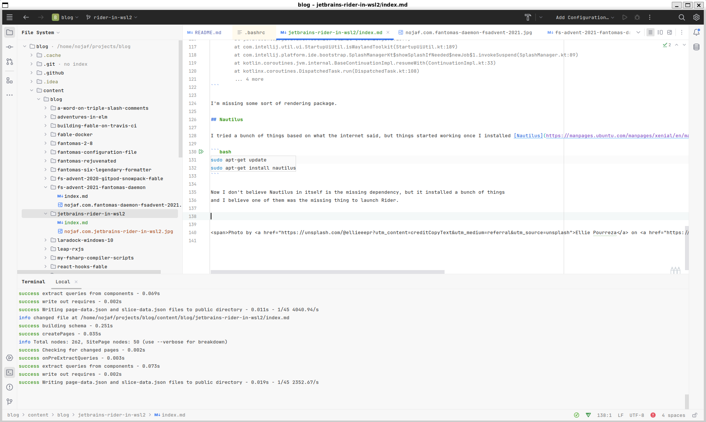

## Intro

Want to run JetBrains Rider in your WSL environment? I recently navigated this process and want to share my insights.
With [WSL2's support for GUI apps](https://learn.microsoft.com/en-us/windows/wsl/tutorials/gui-apps), this is now possible, though not without some hurdles.

## Download Rider EAP

Here's how to start:

- Download the `tar` installation file for the Linux [EAP version](https://www.jetbrains.com/rider/nextversion/) in Windows.
- Extract the files to `/opt` using these commands:

```bash
mv /mnt/c/Users/nojaf/Downloads/JetBrains.Rider-2023.3-EAP7-233.11799.22.Checked.tar.gz ~/
sudo tar -xvzf ~/JetBrains.Rider-2023.3-EAP7-233.11799.22.Checked.tar.gz -C /opt
```

## Launching Rider

Launch Rider with the rider.sh script:

```bash
/opt/JetBrains\ Rider-233.11799.22/bin/rider.sh
```

### Troubleshooting

Rider didn't launch for me:

```
$ /opt/JetBrains\ Rider-233.11799.22/bin/rider.sh
CompileCommand: exclude com/intellij/openapi/vfs/impl/FilePartNodeRoot.trieDescend bool exclude = true

Start Failed
Internal error. Please refer to https://jb.gg/ide/critical-startup-errors

kotlinx.coroutines.JobCancellationException: Parent job is Cancelling; job=UndispatchedCoroutine{Cancelling}@1f4fb181
Caused by: java.lang.UnsatisfiedLinkError: /opt/JetBrains Rider-233.11799.22/jbr/lib/libawt_xawt.so: libXrender.so.1: cannot open shared object file: No such file or directory
        at java.base/jdk.internal.loader.NativeLibraries.load(Native Method)
        at java.base/jdk.internal.loader.NativeLibraries$NativeLibraryImpl.open(NativeLibraries.java:388)
        at java.base/jdk.internal.loader.NativeLibraries.loadLibrary(NativeLibraries.java:232)
        at java.base/jdk.internal.loader.NativeLibraries.loadLibrary(NativeLibraries.java:174)
        at java.base/java.lang.ClassLoader.loadLibrary(ClassLoader.java:2394)
        at java.base/java.lang.Runtime.load0(Runtime.java:755)
        at java.base/java.lang.System.load(System.java:1953)
        at java.base/jdk.internal.loader.NativeLibraries.load(Native Method)
        at java.base/jdk.internal.loader.NativeLibraries$NativeLibraryImpl.open(NativeLibraries.java:388)
        at java.base/jdk.internal.loader.NativeLibraries.loadLibrary(NativeLibraries.java:232)
        at java.base/jdk.internal.loader.NativeLibraries.loadLibrary(NativeLibraries.java:174)
        at java.base/jdk.internal.loader.NativeLibraries.findFromPaths(NativeLibraries.java:315)
        at java.base/jdk.internal.loader.NativeLibraries.loadLibrary(NativeLibraries.java:285)
        at java.base/java.lang.ClassLoader.loadLibrary(ClassLoader.java:2403)
        at java.base/java.lang.Runtime.loadLibrary0(Runtime.java:818)
        at java.base/java.lang.System.loadLibrary(System.java:1989)
        at java.desktop/java.awt.Toolkit$2.run(Toolkit.java:1388)
        at java.desktop/java.awt.Toolkit$2.run(Toolkit.java:1386)
        at java.base/java.security.AccessController.doPrivileged(AccessController.java:318)
        at java.desktop/java.awt.Toolkit.loadLibraries(Toolkit.java:1385)
        at java.desktop/java.awt.Toolkit.initStatic(Toolkit.java:1428)
        at java.desktop/java.awt.Toolkit.<clinit>(Toolkit.java:1397)
        at com.intellij.util.ui.StartupUiUtil.isWaylandToolkit(StartupUiUtil.kt:189)
        at com.intellij.platform.ide.bootstrap.SplashManagerKt$showSplashIfNeeded$newJob$1.invokeSuspend(SplashManager.kt:89)
        at kotlin.coroutines.jvm.internal.BaseContinuationImpl.resumeWith(ContinuationImpl.kt:33)
        at kotlinx.coroutines.DispatchedTask.run(DispatchedTask.kt:108)
        at kotlinx.coroutines.scheduling.CoroutineScheduler.runSafely(CoroutineScheduler.kt:584)
        at kotlinx.coroutines.scheduling.CoroutineScheduler$Worker.executeTask(CoroutineScheduler.kt:793)
        at kotlinx.coroutines.scheduling.CoroutineScheduler$Worker.runWorker(CoroutineScheduler.kt:697)
        at kotlinx.coroutines.scheduling.CoroutineScheduler$Worker.run(CoroutineScheduler.kt:684)

-----
Your JRE: 17.0.9+7-b1087.3 amd64 (JetBrains s.r.o.)
/opt/JetBrains Rider-233.11799.22/jbr

Also, a UI exception occurred on an attempt to show the above message
java.lang.NoClassDefFoundError: Could not initialize class java.awt.Toolkit
        at java.desktop/java.awt.Component.<clinit>(Component.java:628)
        at com.intellij.platform.ide.bootstrap.StartupErrorReporter.showMessage(StartupErrorReporter.java:111)
        at com.intellij.platform.ide.bootstrap.StartupErrorReporter.showMessage(StartupErrorReporter.java:61)
        at com.intellij.platform.ide.bootstrap.StartupUtil.lockSystemDirs(main.kt:627)
        at com.intellij.platform.ide.bootstrap.StartupUtil.access$lockSystemDirs(main.kt:1)
        at com.intellij.platform.ide.bootstrap.StartupUtil$lockSystemDirs$1.invokeSuspend(main.kt)
        at kotlin.coroutines.jvm.internal.BaseContinuationImpl.resumeWith(ContinuationImpl.kt:33)
        at kotlinx.coroutines.DispatchedTask.run(DispatchedTask.kt:106)
        at kotlinx.coroutines.scheduling.CoroutineScheduler.runSafely(CoroutineScheduler.kt:584)
        at kotlinx.coroutines.scheduling.CoroutineScheduler$Worker.executeTask(CoroutineScheduler.kt:793)
        at kotlinx.coroutines.scheduling.CoroutineScheduler$Worker.runWorker(CoroutineScheduler.kt:697)
        at kotlinx.coroutines.scheduling.CoroutineScheduler$Worker.run(CoroutineScheduler.kt:684)
Caused by: java.lang.ExceptionInInitializerError: Exception java.lang.UnsatisfiedLinkError: /opt/JetBrains Rider-233.11799.22/jbr/lib/libawt_xawt.so: libXrender.so.1: cannot open shared object file: No such file or directory [in thread "DefaultDispatcher-worker-10"]
        at java.base/jdk.internal.loader.NativeLibraries.load(Native Method)
        at java.base/jdk.internal.loader.NativeLibraries$NativeLibraryImpl.open(NativeLibraries.java:388)
        at java.base/jdk.internal.loader.NativeLibraries.loadLibrary(NativeLibraries.java:232)
        at java.base/jdk.internal.loader.NativeLibraries.loadLibrary(NativeLibraries.java:174)
        at java.base/java.lang.ClassLoader.loadLibrary(ClassLoader.java:2394)
        at java.base/java.lang.Runtime.load0(Runtime.java:755)
        at java.base/java.lang.System.load(System.java:1953)
        at java.base/jdk.internal.loader.NativeLibraries.load(Native Method)
        at java.base/jdk.internal.loader.NativeLibraries$NativeLibraryImpl.open(NativeLibraries.java:388)
        at java.base/jdk.internal.loader.NativeLibraries.loadLibrary(NativeLibraries.java:232)
        at java.base/jdk.internal.loader.NativeLibraries.loadLibrary(NativeLibraries.java:174)
        at java.base/jdk.internal.loader.NativeLibraries.findFromPaths(NativeLibraries.java:315)
        at java.base/jdk.internal.loader.NativeLibraries.loadLibrary(NativeLibraries.java:285)
        at java.base/java.lang.ClassLoader.loadLibrary(ClassLoader.java:2403)
        at java.base/java.lang.Runtime.loadLibrary0(Runtime.java:818)
        at java.base/java.lang.System.loadLibrary(System.java:1989)
        at java.desktop/java.awt.Toolkit$2.run(Toolkit.java:1388)
        at java.desktop/java.awt.Toolkit$2.run(Toolkit.java:1386)
        at java.base/java.security.AccessController.doPrivileged(AccessController.java:318)
        at java.desktop/java.awt.Toolkit.loadLibraries(Toolkit.java:1385)
        at java.desktop/java.awt.Toolkit.initStatic(Toolkit.java:1428)
        at java.desktop/java.awt.Toolkit.<clinit>(Toolkit.java:1397)
        at com.intellij.util.ui.StartupUiUtil.isWaylandToolkit(StartupUiUtil.kt:189)
        at com.intellij.platform.ide.bootstrap.SplashManagerKt$showSplashIfNeeded$newJob$1.invokeSuspend(SplashManager.kt:89)
        at kotlin.coroutines.jvm.internal.BaseContinuationImpl.resumeWith(ContinuationImpl.kt:33)
        at kotlinx.coroutines.DispatchedTask.run(DispatchedTask.kt:108)
        ... 4 more
```

I encountered an error related to libXrender.so.1. It turns out I was missing some rendering packages, which I resolved by installing Nautilus:

```bash
sudo apt-get update
sudo apt-get install nautilus
```

While Nautilus isn't the direct solution, it installs necessary dependencies.



## Resource Management

Running Rider in WSL2 can be resource-intensive. To improve performance, I configured WSL to use more memory:

```
[wsl2]
memory=16GB
```

## Why not use Gateway?

I've had limited success with Gateway for basic tasks. I prefer the current setup because the experience is more or less the same as having Rider in Windows.

## Conclusion

Running JetBrains Rider in WSL2 is feasible and, for me, effective.
Whether it's suitable for daily use remains to be seen, but it's a promising option for developers.

Happy coding,

Florian

<span>Photo by <a href="https://unsplash.com/@ellieeepr?utm_content=creditCopyText&utm_medium=referral&utm_source=unsplash">Ellie Pourreza</a> on <a href="https://unsplash.com/photos/red-petaled-flowers-at-daytime-7wP39t9zRzc?utm_content=creditCopyText&utm_medium=referral&utm_source=unsplash">Unsplash</a></span>
