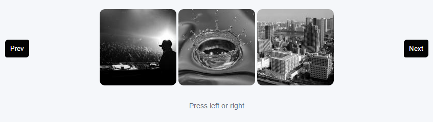
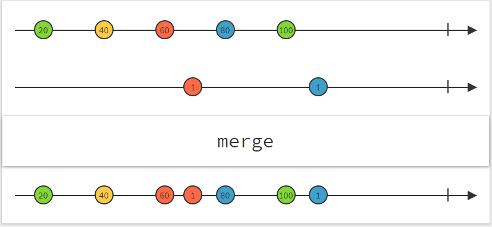
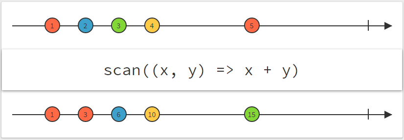

## Introduction

A while ago I wrote some JavaScript to create a custom slideshow. I recently had to revisit that project and I saw an opportunity to fiddle around with [RxJS](https://github.com/Reactive-Extensions/RxJS)

## Explaining the problem

The way the slideshow works is that it shows three images and moves up one frame at a time.  
So initially the first three images are shown and the rest are hidden.



You press the right button to move forward and the left to move backwards. Of course at the beginning of the slideshow you can't move backwards. Thus the left button is hidden. Once you are at the end of the slideshow you don't see the right button anymore.

## The initial approach

We keep track of the current index (starting at zero). When one of the buttons is clicked, we update the index, validate whether the index is still in range, show the correct images and update the buttons.

It looked like:

```js
(function () {
  var index = 0;
  var maxLength = 0;

  function initCategory() {
    maxLength = $(".project-category").length - 2;

    $("#right-arrow").click(function () {
      index++;
      index = index < maxLength ? index : maxLength - 1;
      changeImages();
      showArrows();
    });

    $("#left-arrow").click(function () {
      index--;
      index = index > -1 ? index : 0;
      changeImages();
      showArrows();
    });
  }

  function changeImages() {
    $(".project-category").removeClass("active");
    $($(".project-category")[index]).addClass("active");
    $($(".project-category")[index + 1]).addClass("active");
    $($(".project-category")[index + 2]).addClass("active");
  }

  function showArrows() {
    $("#left-arrow,#right-arrow").hide();

    if (index > 0) {
      $("#left-arrow").show();
    }

    if (index < maxLength - 1) {
      $("#right-arrow").show();
    }
  }

  window.onload = initCategory;
})();
```

### The downside

The index was somewhat a global variable, _ok all the code was in a closure but all of the code depends on a single variable._

I had two click handlers that were way too similar.

## A new requirement

In order to improve the user experience I wanted the slideshow to work with the arrow keys as well.

You guessed it, it led to another event handler (keyup) that modified the index variable and called the `changeImages` and `showArrows` function. It was slowly becoming a mess.

## Enter RxJS

When I needed to add support for the arrow keys it started to become clear that we are only interested in the changes to the index. Each change is an event (click or keyup) that either goes forward or backwards. The sum of all the changes is the current state of the index.

So what if we could map every click on the left button to -1 and every click on the right to +1?

```js
var leftArrow = document.querySelector(".left");
var rightArrow = document.querySelector(".right");

var rightClickSource = Rx.Observable.fromEvent(rightArrow, "click").map(
  (e) => 1,
);

var leftClickSource = Rx.Observable.fromEvent(leftArrow, "click").map(
  (e) => -1,
);
```

And each time an arrow key is pressed, we'd like to keep track of that too.

```js
var arrowKeysSource = Rx.Observable.fromEvent(document, "keyup")
  .filter((e) => e.keyCode === 37 || e.keyCode === 39)
  .map((e) => (e.keyCode === 39 ? 1 : -1));
```

### Rx Marbles

One very helpful site to wrap your head around all the RxJS functions is [RxMarbles](http://rxmarbles.com/).

To determine the value of my index I need to do a **merge** and a **scan** on my sources.





```js
var source = Rx.Observable.merge(
  rightClickSource,
  leftClickSource,
  arrowKeysSource,
)
  .scan((acc, currentValue) => {
    var nextValue = acc + currentValue;
    nextValue = nextValue < maxLength ? nextValue : maxLength - 1;
    nextValue = nextValue > -1 ? nextValue : 0;
    return nextValue;
  }, 0)
  .startWith(0);
```

Notice that I do some validation in my scan callback.

### Subscribe!

The missing piece of the puzzle is now to trigger the `changeImages` and `showArrows` functions. We can do this by _subscribing_ to `source` observable.

```
source.subscribe((next) => {
  changeImages(next);
  showArrows(next);
});
```

## The Source

I've created a [jsfiddle](https://jsfiddle.net/46am0wmf/14/) with the result.

## Remarks

- I really learned a lot by this little experiment and I encourage you to definitely check out RxJS
- The final example doesn't use jQuery and is written with Babel.
- Please correct me if you find any mistakes.

## Final words

RxJS rocks! If you have any suggestions or questions please leave a comment.

Yours truly,  
nojaf
