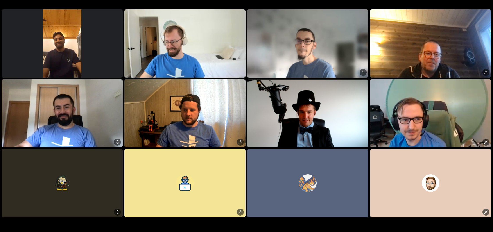
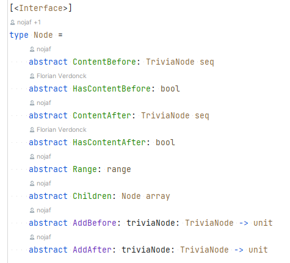

---
path: "2022/12/22/the-oak-sleeps-in-the-acorn/"
date: "2022-12-22"
title: "The oak sleeps in the acorn"
tags: ["open-source", "fsharp", "fantomas", "tooling"]
cover: "./blog.nojaf.com-the-oak-sleeps-in-the-acorn.jpg"
backgroundPosition: "initial"
---

## Introduction

We launched Fantomas v5 in September, and it was the first version to ship with a custom F# parser and an improved syntax tree.
Many view it as a big technical achievement – I know its launch was a point of personal pride.

## Release party

Because version 5 was a big deal, I decided to organize a grand release party where we talked about how [v5](https://github.com/fsprojects/fantomas/releases/tag/v5.0.0) came to be,
what exactly changes for end-users and I wrapped it up with a well-deserved glass of champagne. The project is in a good state. We have a brand new [documentation website](https://fsprojects.github.io/fantomas/docs/index.html), I onboarded a new co-maintainer [David](https://github.com/dawedawe), and overall the codebase has never been better.  
Contributors who sent me their home address, received a tee-shirt in the mail too.

## Work remains

Fantomas will always be a very malleable project. This project demands a lot of care and maintenance over time, and exceptional endeavours have been undertaken to lessen the burden.
But there is always something left to improve. Be it the syntax tree, be it the style guide, or the editor integration there will always be something left to update, make better, or to maintain.

Nowadays, I will personally only address topics of interest over the weekend as a hobby. This removes any weight from my shoulders that is implied by being a maintainer.

## Growing the community

Ever since David joined me as co-maintainer of Fantomas, I'm quite intrigued on how I can get more people involved in the project.
A response to that was adding more and more documentation. I recently wrote [a guide](https://fsprojects.github.io/fantomas/docs/contributors/The%20Missing%20Comment.html) with steps that people can take to solve a missing-code comment problem.
This is frustrating problem- space in Fantomas. Yet, once you get a sense of how things work, you can easily see solutions. I must admit, these seven steps in the guide do expose the fact that the overall flow is a bit complicated.

In a nutshell, when we process F# code, we only know that comments appeared in the file, as in "somewhere" in the file – and that is it.
Via a caching system, we try and figure out what the best location is to restore the comment and hope that somewhat it plays out.
We need that caching system because we can't extend the F# syntax tree model which the parser creates.

## Project Dallas

I've been working on a custom syntax tree that better suits the needs of Fantomas for some time.
We transform the existing syntax tree into a custom syntax tree that has consists of out of Nodes. The `Node` interface allows us to retrieve child nodes and can store and retrieve trivia items, (like code comments).
This allows us to insert the code comments directly into the tree and removes the need for a cache.

Another benefit of our own tree is that we can customize it for our needs. The untyped tree from the compiler works for the F# compiler but stores the information sometimes a bit oddly for our use-case.

Some subtle differences:

- Our tree doesn't differentiate between implementation and signature files.
- We can group certain nodes in a different way. For example, recursive types are considered as top-level.
- We can skip combinations of nodes that the parser would never be able to create.
- We can simplify a lot of nodes by reducing them to only expose the core information.
- We can use more accurate ranges by combining positions instead of relying on the approximate information of the compiler.

Refactoring the codebase to use our custom tree was also quite a lot of work. I had to port all our code into a new model and shuffle a lot of things around.
The result is that the flow is a lot less complicated than before. I am optimistic that this work will lead to more contributions from the community in the future.

## Give it a spin

We currently have around 2380 unit tests for Fantomas, which may sound like a lot, but still may not fully cover your codebase. The F# language is vast and ever growing.
So, I do ask you to give our new implementation a spin on your existing code. Make sure you are on the latest stable release before you compare it the `v5.2` alphas.
Please report any issues you encounter so that we can continue to improve.

Happy formatting,

Florian
